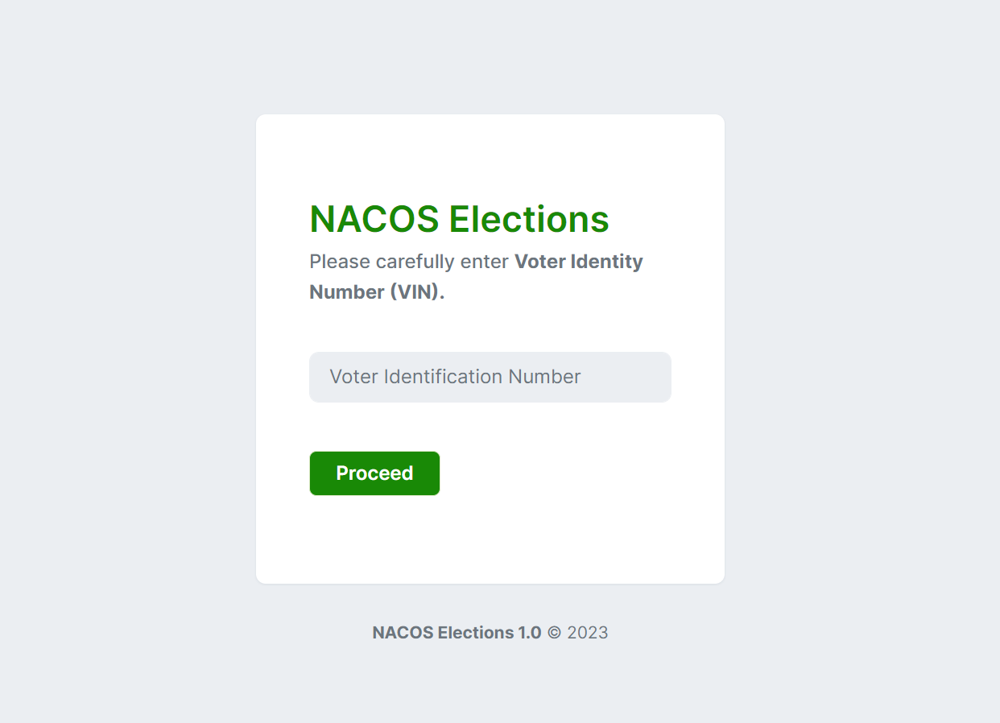
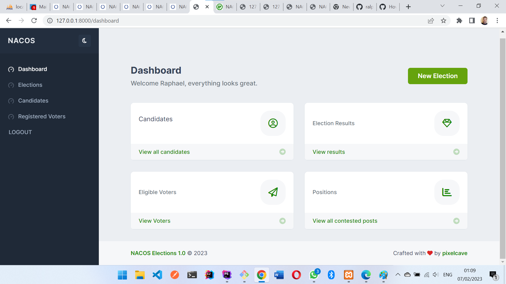
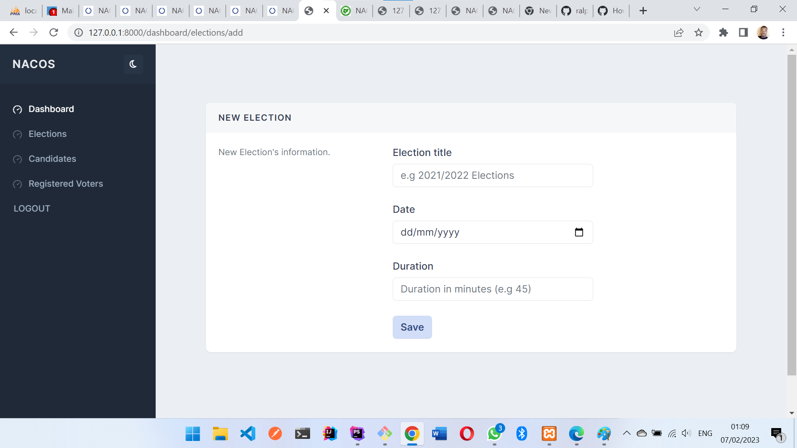
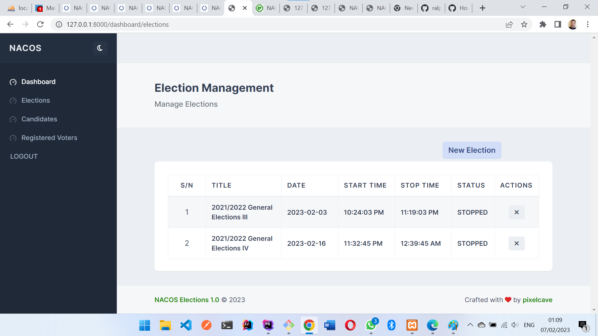
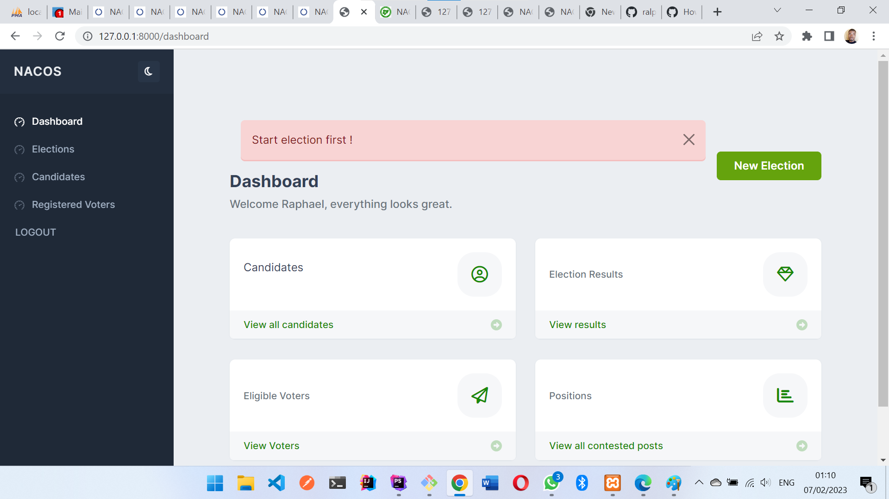
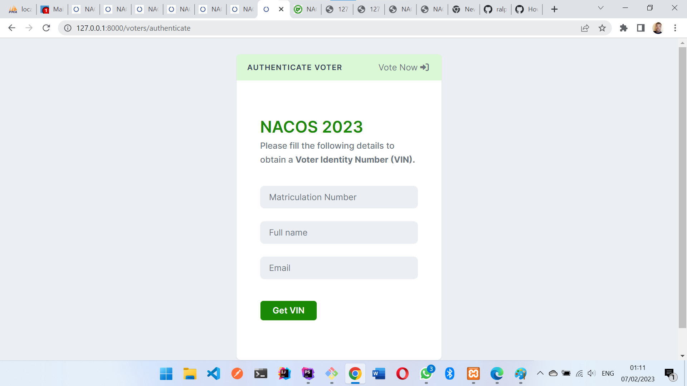
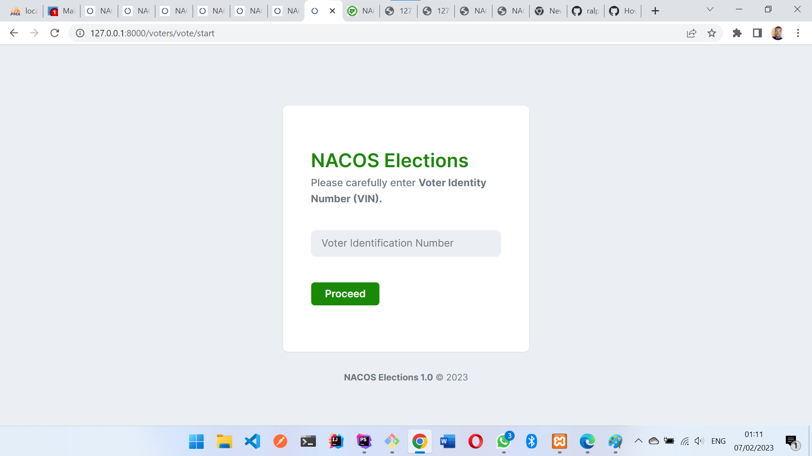

## About NACOS

The Nigeria Association of Computing Students (NACOS) is a community of Students in higher institutions of the Federal Republic of Nigeria. Members of this community study several professions in the field of computing such as:

- Computer Science
- Software Engineering 
- Cyber Security
- Computer Engineering
- Information Systems
- Information Technology.

## About the Application

This application was built to provide a platform where members of NACOS will come and vote for candidates of their choice during sessional NACOS elections. Every voter is authenticated with an already registered Matriculation number and the assigned a Voter Identification Number (VIN) which expires upon vote casting by this voter. 
Candidates, Voters and positions can only be functional when an election is started.

## Screenshots

The Laravel framework is open-sourced software licensed under the [MIT license](https://opensource.org/licenses/MIT).
